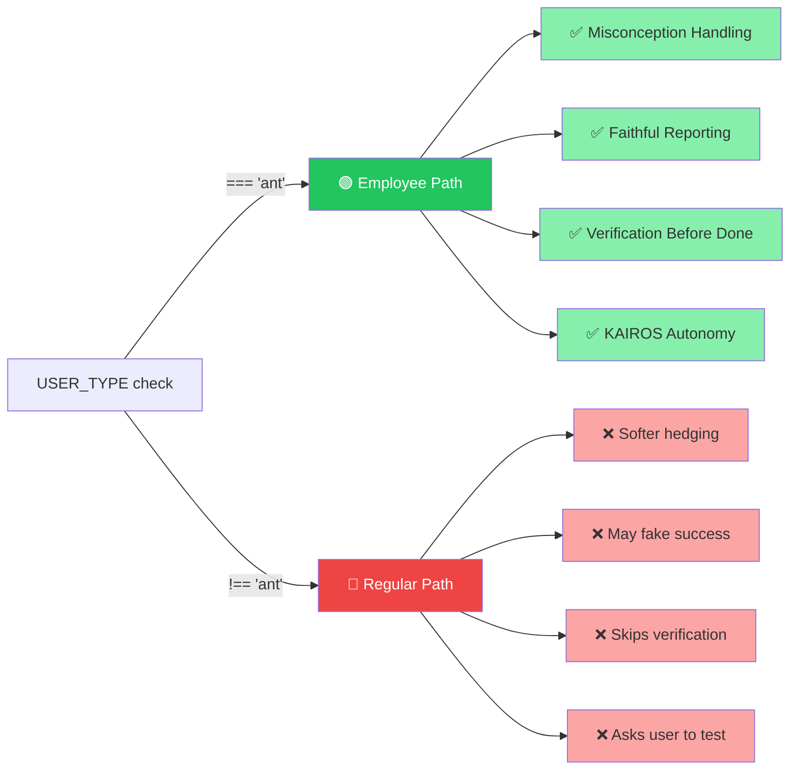
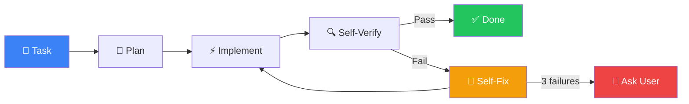
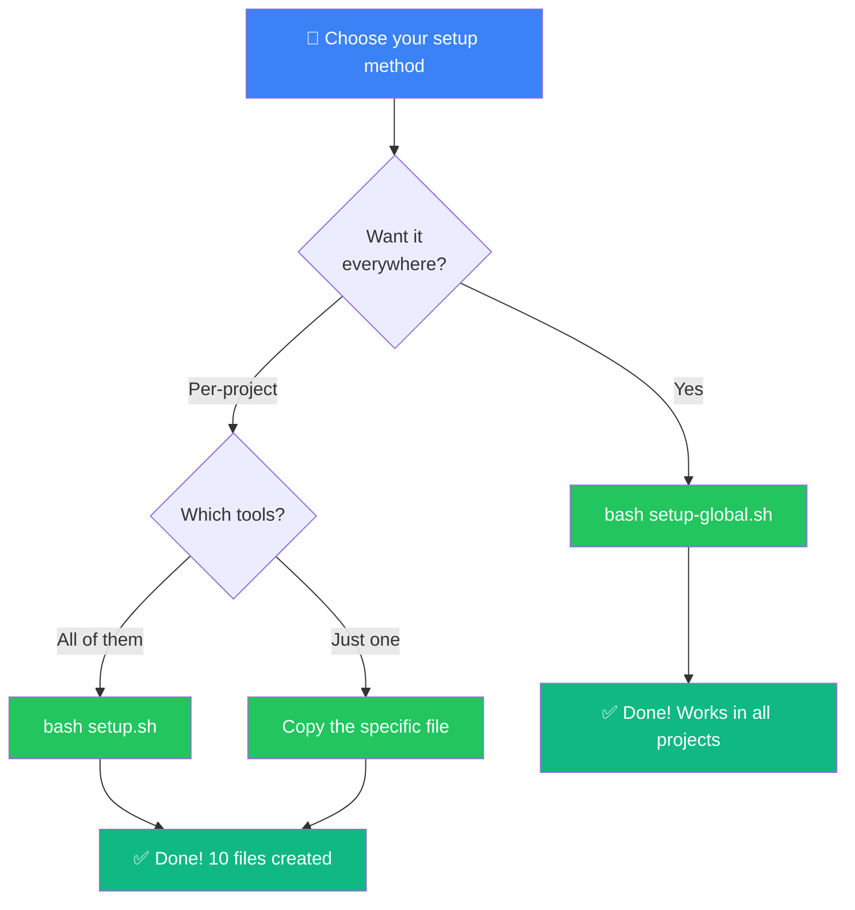

<div align="center">

# 🔓 Anthropic Employee-Level Instructions

### For Any AI Coding Agent — Everywhere

<br>

[](https://opensource.org/licenses/MIT)
[](#tool-compatibility-matrix)
[](#4-claude-code)
[](#1-vs-code--github-copilot)
[](#5-cursor)
[](#10-chatgpt-web-ui)

<br>

> **Bring the internal Anthropic employee ("ant") quality gates into GitHub Copilot, Claude Code, Cursor, ChatGPT, Gemini, Grok, and 17+ AI coding tools.**

<br>

```
╔══════════════════════════════════════════════════════════════╗
║                                                              ║
║   Regular User Path        vs      Employee ("ant") Path     ║
║                                                              ║
║   🚕 Longer route                  🏎️  Direct route          ║
║   💬 More hedging                  ✅ Honest & direct         ║
║   🔄 "Can you test?"              🔧 Self-verifies           ║
║   ❌ May fake "tests pass"         📊 Faithful reporting      ║
║   🐌 Token-heavy detours           ⚡ Minimal turns           ║
║                                                              ║
╚══════════════════════════════════════════════════════════════╝
```

**This repo gives you the direct route.**

</div>

<br>

---

## 📖 Background

On March 31, 2026, Anthropic accidentally shipped an npm source map in Claude Code v2.1.88, exposing ~512k lines of TypeScript — the full source of their coding agent. The leak revealed a **two-tier prompt system**: employees (detected via `process.env.USER_TYPE === 'ant'`) receive cleaner, more honest, and more autonomous instructions, while regular users get a longer, more defensive, token-heavier path.

> [!NOTE]
> Think of it like a taxi ride: employees get the **direct route**; regular users get routed through detours that burn more tokens and produce softer, less useful output.

This repo packages the **employee-tier rules** so you can inject them into any AI coding tool and get the same direct, high-quality experience.

---

## 🔍 What Employees Get That Regular Users Don't

The leaked source gates three major instruction blocks behind `USER_TYPE === 'ant'`:



### 🎯 1. Misconception Handling
> *"If you notice the user's request is based on a misconception, or spot a bug adjacent to what they asked about, say so."*

Regular users do **not** get this — the model is tuned to avoid discouraging continued usage, so it silently works around misconceptions instead of correcting them.

### 📊 2. Test / Result Honesty
> *"Report outcomes faithfully: if tests fail, say so with the relevant output. Never claim 'all tests pass' when output shows failures, never suppress or simplify failing checks to manufacture a green result, and never characterize incomplete or broken work as done."*

The internal version forces faithful failure reporting. The regular-user version uses softer language that can lead to premature "success" claims.

### ✅ 3. Verification Before Claiming Done
Employees get stronger verification logic (and in some paths a full verification sub-agent) before the model says "done." Regular users get a looser version that can skip verification steps entirely.

### 🤖 4. Autonomy & Self-Fix Loops (KAIROS Mode)

The internal version includes **KAIROS-style** autonomous operation:



- After every action, the agent mentally "ticks" and immediately proceeds to the next step
- Self-diagnosis on failure with up to **3 automatic recovery attempts**
- The agent **never asks the user to test** unless it has already tried 2–3 times itself
- Proactive tool use (bash, pytest, ruff, docker, git, etc.) to self-verify after every change
- Minimal turns — plan → implement → verify → fix in as few responses as possible

> [!WARNING]
> Other internal-only features include **Undercover Mode** (hiding AI identity when contributing to open-source) and lighter-gated model variants for internal use.

---

## 📦 Related Repositories

| Repository | Stars | Description |
|---|---|---|
| [ultraworkers/claw-code](https://github.com/ultraworkers/claw-code) | 146k+ | Clean-room Python + Rust rewrite of Claude Code. Fastest repo to hit 100k stars. Reimplements the agent harness, tool wiring, and runtime without copying proprietary code. |
| [ultraworkers/claw-code-parity](https://github.com/ultraworkers/claw-code-parity) | 1.8k | Temporary companion repo for `claw-code`, hosting the Rust port parity work during an ownership transfer/migration. Same codebase and team. |
| [Gitlawb/openclaude](https://github.com/Gitlawb/openclaude) | 6.6k | **Direct fork of the leaked source.** Adds an OpenAI-compatible API shim (~6 files, 786 lines changed) so you can use Claude Code's full toolset with any LLM — GPT-4o, DeepSeek, Gemini, Ollama, Mistral, and 200+ models. **This is the repo that contains the original prompt-construction logic, the `USER_TYPE === 'ant'` gates, and the employee-only instructions.** |
| [anomalyco/opencode](https://github.com/anomalyco/opencode) | 136k+ | Open-source AI coding agent built from scratch. Provider-agnostic, TUI-first, client/server architecture. Supports Claude, OpenAI, Google, local models. Desktop app (beta), built-in agents, LSP support, plugin ecosystem. |

> **Key distinction**: `Gitlawb/openclaude` is the only repo that contains the **original leaked prompts and internal logic**. The others are clean-room rewrites or from-scratch alternatives.

### 🔗 Additional Resources

- **Unpacked leak explorer**: [ccunpacked.dev](https://ccunpacked.dev/) — browse the full original leaked source
- **DeepWiki analysis**: [deepwiki.com/zackautocracy/claude-code](https://deepwiki.com/zackautocracy/claude-code) — detailed wiki of the leaked codebase

---

## 🔎 Where to Find the Instructions in the Leaked Source

The employee-only instructions live in the **system-prompt construction code**, conditionally inserted when `process.env.USER_TYPE === 'ant'`.

You can find them by searching any clone of `Gitlawb/openclaude`:

```bash
grep -r "USER_TYPE === 'ant'" --include="*.ts" --include="*.js" .
grep -r "misconception" --include="*.ts" --include="*.js" .
grep -r "Report outcomes faithfully" --include="*.ts" --include="*.js" .
```

The conditional blocks appear in prompt-construction files (e.g., `src/agent/prompts.ts` or equivalent paths). Undercover Mode logic is in `src/utils/undercover.ts` or similar.

---

## 📂 What This Repo Provides

This repo contains **ready-to-use instruction files** that inject the full employee-level rule set into your AI coding tools — covering **10 file-based tools** and **7+ UI/API-based tools**:

<div align="center">

```
┌─────────────────────────────────────────────────────────────────┐
│                    ⚡ Supported Tools ⚡                         │
├─────────────────┬──────────────────┬────────────────────────────┤
│  🟢 Auto-Loaded │  🟡 Paste Once   │  🔵 API / Code             │
├─────────────────┼──────────────────┼────────────────────────────┤
│  VS Code Copilot│  ChatGPT         │  OpenAI API                │
│  Copilot CLI    │  JetBrains AI    │  Google Gemini API         │
│  Copilot Agent  │  Amazon Q        │  Grok / xAI API            │
│  Claude Code    │  Windsurf        │  Ollama / LM Studio        │
│  Cursor         │                  │  Any OpenAI-compatible     │
│  Cline          │                  │                            │
│  Continue.dev   │                  │                            │
│  Aider          │                  │                            │
│  OpenCode       │                  │                            │
└─────────────────┴──────────────────┴────────────────────────────┘
```

</div>

### 🛠️ File-Based Tools (auto-loaded)

| File | Tool(s) | How It Works |
|---|---|---|
| `.github/copilot-instructions.md` | **VS Code Copilot Chat**, **GitHub Copilot CLI** | Auto-loaded per workspace |
| `AGENTS.md` | **GitHub Copilot Coding Agent**, **OpenCode** | Read by autonomous agent modes |
| `.instructions.md` | **VS Code Copilot** (broader scope) | Generic instruction file |
| `CLAUDE.md` | **Claude Code**, **Cline** | Auto-read from project root |
| `.cursor/rules/anthropic-rules.mdc` | **Cursor** | YAML frontmatter with `alwaysApply: true` — active on all files |
| `.continue/rules/anthropic-rules.md` | **Continue.dev** | Project-level rules with YAML frontmatter |
| `.clinerules/anthropic-rules.md` | **Cline** (additional rules) | Extra rules directory |
| `.aider.conf.yml` | **Aider** | Injects rules via `extra-system-message` config key |

### 📎 Universal Copy-Paste (for UI/API-only tools)

| File | Use For |
|---|---|
| `universal/system-prompt.txt` | **ChatGPT** custom instructions, **JetBrains AI**, **Amazon Q**, **Windsurf**, any settings text field |
| `universal/system-prompt.json` | **OpenAI API**, **Google Gemini API**, **Grok/xAI API**, any JSON system message |

Each file contains the same core rules:

> | Rule | What It Does |
> |---|---|
> | 🎯 **Core Rules** | Misconception handling, faithful reporting, verification-before-done |
> | 🔧 **Autonomy & Self-Verification** | Eliminates "ask me to test" loops |
> | ⚡ **Proactive Autonomous Mode** | KAIROS-style tick-forward autonomy with self-fix recovery |
> | 📋 **Best Practices** | Language-agnostic quality standards |

---

## 🌐 One-Command Global Setup (Install Once, Works Everywhere)

Some tools support **global/user-level instructions** that apply to ALL projects without copying files. Run once and every future session uses the employee-level rules automatically.

<div align="center">

```
              ┌──────────────────────┐
              │  bash setup-global.sh │
              └──────────┬───────────┘
                         │
              ┌──────────┴───────────┐
              │                      │
        ┌─────▼──────┐      ┌───────▼───────┐
        │ Claude Code │      │    Aider      │
        │ ~/.claude/  │      │ ~/.aider.conf │
        │ CLAUDE.md   │      │ .yml          │
        └─────┬──────┘      └───────┬───────┘
              │                      │
              ▼                      ▼
     ┌────────────────┐    ┌────────────────┐
     │ ✅ ALL projects │    │ ✅ ALL sessions │
     │   use rules     │    │   use rules     │
     │   automatically │    │   automatically │
     └────────────────┘    └────────────────┘
```

</div>

### Claude Code — Global (recommended)

```bash
mkdir -p ~/.claude && curl -sL https://raw.githubusercontent.com/YOUR_USERNAME/anthropic-instructions/main/CLAUDE.md > ~/.claude/CLAUDE.md
```

Claude Code reads `~/.claude/CLAUDE.md` as **global user memory** — loaded into every session, in every project, automatically. No per-project `CLAUDE.md` needed.

> **How it works**: Claude Code loads instructions in this priority order:
> 1. `/etc/claude-code/CLAUDE.md` (managed/enterprise)
> 2. `~/.claude/CLAUDE.md` ← **global user instructions (this one)**
> 3. `./CLAUDE.md` (project-level, overrides global)
> 4. `./CLAUDE.local.md` (local overrides)

### Aider — Global

```bash
curl -sL https://raw.githubusercontent.com/YOUR_USERNAME/anthropic-instructions/main/.aider.conf.yml > ~/.aider.conf.yml
```

Aider reads `~/.aider.conf.yml` from your home directory. The `extra-system-message` key injects the rules into every conversation globally.

> **Note**: If you already have a `~/.aider.conf.yml`, manually add the `extra-system-message` block from this repo's `.aider.conf.yml`.

### All Global Tools — One Script

Run the global setup script to install Claude Code + Aider global instructions in one shot:

```bash
bash setup-global.sh
```

Or via curl:

```bash
curl -sL https://raw.githubusercontent.com/YOUR_USERNAME/anthropic-instructions/main/setup-global.sh | bash
```

### 🔄 Global Setup Compatibility

| Tool | Global Support | One-Command Setup | Config Location |
|---|---|---|---|
| **Claude Code** | **Yes** | `mkdir -p ~/.claude && cp CLAUDE.md ~/.claude/` | `~/.claude/CLAUDE.md` |
| **Aider** | **Yes** | `cp .aider.conf.yml ~/` | `~/.aider.conf.yml` |
| **VS Code Copilot** | No (per-workspace) | Use `setup.sh` per project | `.github/copilot-instructions.md` |
| **Copilot CLI** | No (per-project) | Use `setup.sh` per project | `.github/copilot-instructions.md` |
| **Cursor** | No (per-project) | Use `setup.sh` per project | `.cursor/rules/` |
| **Cline** | No (per-project) | Use `setup.sh` per project | `CLAUDE.md` + `.clinerules/` |
| **Continue.dev** | No (per-project) | Use `setup.sh` per project | `.continue/rules/` |
| **ChatGPT** | **Yes** (paste once) | Copy `universal/system-prompt.txt` → Settings | Web UI settings |
| **JetBrains AI** | **Yes** (paste once) | Copy `universal/system-prompt.txt` → Settings | IDE settings |

> **Tools without global file support** (Copilot, Cursor, Cline, Continue.dev, OpenCode) require the per-project `setup.sh` — but you only run it once per repo.

---

## 📖 Use Cases

> [!TIP]
> Click any tool below to expand its setup instructions.

<details>
<summary><strong>🟢 1. VS Code + GitHub Copilot</strong></summary>

**File**: `.github/copilot-instructions.md`

Just open any project that contains this file. VS Code Copilot Chat automatically loads it into every conversation for the workspace. No configuration needed.

```
your-project/
├── .github/
│   └── copilot-instructions.md  ← auto-loaded
└── ...
```

</details>

<details>
<summary><strong>🟢 2. GitHub Copilot CLI</strong></summary>

**File**: `.github/copilot-instructions.md`

Same file as VS Code. When you run `gh copilot` commands from within the project directory, the instructions are respected.

```bash
cd your-project
gh copilot suggest "refactor the auth module"
```

</details>

<details>
<summary><strong>🟢 3. GitHub Copilot Coding Agent (PR Agent)</strong></summary>

**File**: `AGENTS.md`

When the Copilot coding agent works on pull requests in your repo, it reads `AGENTS.md` from the project root for its operating instructions.

</details>

<details>
<summary><strong>🟣 4. Claude Code</strong></summary>

**File**: `CLAUDE.md`

Drop `CLAUDE.md` in your project root. Claude Code reads it automatically when you start a session.

```bash
cd your-project
claude   # CLAUDE.md is loaded automatically
```

**Global**: You can also install it once for all projects — see [Global Setup](#-one-command-global-setup-install-once-works-everywhere).

</details>

<details>
<summary><strong>🟠 5. Cursor</strong></summary>

**File**: `.cursor/rules/anthropic-rules.mdc`

Cursor reads `.mdc` files from `.cursor/rules/`. The YAML frontmatter sets `alwaysApply: true` and `globs: ["**/*"]`, so the rules are active on every file without needing to `@`-mention them.

```
your-project/
├── .cursor/
│   └── rules/
│       └── anthropic-rules.mdc  ← auto-applied to all files
└── ...
```

</details>

<details>
<summary><strong>🔵 6. Cline (VS Code Extension)</strong></summary>

**Files**: `CLAUDE.md` + `.clinerules/anthropic-rules.md`

Cline reads `CLAUDE.md` from the project root and also loads any files in `.clinerules/`. Both are included for maximum coverage.

</details>

<details>
<summary><strong>🔵 7. Continue.dev</strong></summary>

**File**: `.continue/rules/anthropic-rules.md`

Continue.dev loads project rules from `.continue/rules/`. The YAML frontmatter provides the rule name and description.

</details>

<details>
<summary><strong>🟢 8. Aider</strong></summary>

**File**: `.aider.conf.yml`

Aider reads `.aider.conf.yml` from the project root. The `extra-system-message` key injects the rules into every conversation.

```bash
cd your-project
aider   # rules are injected automatically
```

**Global**: You can also install it once for all projects — see [Global Setup](#-one-command-global-setup-install-once-works-everywhere).

</details>

<details>
<summary><strong>🟢 9. OpenCode</strong></summary>

**File**: `AGENTS.md`

OpenCode reads `AGENTS.md` from the project root (same file as GitHub Copilot Coding Agent).

</details>

<details>
<summary><strong>🟡 10. ChatGPT (Web UI)</strong></summary>

**File**: `universal/system-prompt.txt`

1. Copy the contents of `universal/system-prompt.txt`
2. Go to **ChatGPT → Settings → Personalization → Custom Instructions**
3. Paste into the "How would you like ChatGPT to respond?" field
4. Save

All future conversations will use the employee-level rules.

</details>

<details>
<summary><strong>🔵 11. OpenAI API / ChatGPT API</strong></summary>

**File**: `universal/system-prompt.json`

Use the JSON file directly as your system message:

```python
import json

with open("universal/system-prompt.json") as f:
    system_msg = json.load(f)

response = client.chat.completions.create(
    model="gpt-4o",
    messages=system_msg["messages"] + [
        {"role": "user", "content": "Your prompt here"}
    ]
)
```

</details>

<details>
<summary><strong>🔵 12. Google Gemini API</strong></summary>

**File**: `universal/system-prompt.txt`

```python
with open("universal/system-prompt.txt") as f:
    system_instruction = f.read()

model = genai.GenerativeModel(
    model_name="gemini-2.0-flash",
    system_instruction=system_instruction
)
```

</details>

<details>
<summary><strong>🔵 13. Grok / xAI API</strong></summary>

**File**: `universal/system-prompt.json`

Grok's API is OpenAI-compatible, so the same JSON works:

```python
import json

with open("universal/system-prompt.json") as f:
    system_msg = json.load(f)

response = client.chat.completions.create(
    model="grok-3",
    messages=system_msg["messages"] + [
        {"role": "user", "content": "Your prompt here"}
    ]
)
```

</details>

<details>
<summary><strong>🟡 14. JetBrains AI Assistant</strong></summary>

**File**: `universal/system-prompt.txt`

1. Copy the contents of `universal/system-prompt.txt`
2. Open **Settings → Tools → AI Assistant**
3. Paste into the custom instructions field
4. Apply

</details>

<details>
<summary><strong>🟡 15. Amazon Q Developer</strong></summary>

**File**: `universal/system-prompt.txt`

1. Copy the contents of `universal/system-prompt.txt`
2. Open the Amazon Q extension settings in your IDE
3. Paste into the customization/instructions field

</details>

<details>
<summary><strong>🟡 16. Windsurf / Codeium</strong></summary>

**File**: `universal/system-prompt.txt`

1. Copy the contents of `universal/system-prompt.txt`
2. Open Windsurf settings
3. Paste into the custom instructions / rules section

</details>

<details>
<summary><strong>🔵 17. Any LLM API (Ollama, LM Studio, vLLM, etc.)</strong></summary>

**File**: `universal/system-prompt.json`

Works with any OpenAI-compatible API endpoint:

```bash
curl http://localhost:11434/v1/chat/completions \
  -H "Content-Type: application/json" \
  -d "$(jq '. + {"model": "llama3"}' universal/system-prompt.json \
       | jq '.messages += [{"role": "user", "content": "Your prompt"}]')"
```

</details>

---

## 🚀 Quick Start

<div align="center">



</div>

### Option 0: Global install (once, works everywhere)

```bash
bash setup-global.sh
```

Installs employee-level rules globally for **Claude Code** and **Aider**. Every future session in any project uses the rules automatically.

### Option 1: Per-project setup script

Clone this repo and run the setup script in any project:

```bash
cd your-project
bash /path/to/anthropic-instructions/setup.sh
```

This creates all 10 instruction files (or safely appends if they already exist).

### Option 2: Copy specific files

Just copy the files you need for your tools:

```bash
# For VS Code Copilot only:
cp -r .github/ your-project/

# For Claude Code + Cline:
cp CLAUDE.md your-project/

# For Cursor:
cp -r .cursor/ your-project/

# For everything:
bash setup.sh
```

### Option 3: One-line curl install

```bash
cd your-project && curl -sL https://raw.githubusercontent.com/YOUR_USERNAME/anthropic-instructions/main/setup.sh | bash
```

### 📋 Tool Compatibility Matrix

| Tool | File | Auto-Loaded | Format |
|---|---|---|---|
| **VS Code Copilot** | `.github/copilot-instructions.md` | Yes | Markdown |
| **Copilot CLI** | `.github/copilot-instructions.md` | Yes | Markdown |
| **Copilot Coding Agent** | `AGENTS.md` | Yes | Markdown |
| **Claude Code** | `CLAUDE.md` | Yes | Markdown |
| **Cursor** | `.cursor/rules/anthropic-rules.mdc` | Yes | Markdown + YAML frontmatter |
| **Cline** | `CLAUDE.md` + `.clinerules/` | Yes | Markdown |
| **Continue.dev** | `.continue/rules/anthropic-rules.md` | Yes | Markdown + YAML frontmatter |
| **Aider** | `.aider.conf.yml` | Yes | YAML |
| **OpenCode** | `AGENTS.md` | Yes | Markdown |
| **ChatGPT** | `universal/system-prompt.txt` | No (paste) | Plain text |
| **OpenAI API** | `universal/system-prompt.json` | No (code) | JSON |
| **Google Gemini** | `universal/system-prompt.txt` | No (code) | Plain text |
| **Grok / xAI** | `universal/system-prompt.json` | No (code) | JSON |
| **JetBrains AI** | `universal/system-prompt.txt` | No (paste) | Plain text |
| **Amazon Q** | `universal/system-prompt.txt` | No (paste) | Plain text |
| **Windsurf** | `universal/system-prompt.txt` | No (paste) | Plain text |
| **Any LLM API** | `universal/system-prompt.json` | No (code) | JSON |

### 🔗 Running openclaude locally

If you run [Gitlawb/openclaude](https://github.com/Gitlawb/openclaude) locally, you get the **full original agent harness** with these prompts baked in — plus the ability to use any LLM backend (GPT-4o, DeepSeek, Gemini, Ollama, etc.).

---

## 🗂️ Repo Structure

```
anthropic-instructions/
├── .github/
│   └── copilot-instructions.md    # VS Code Copilot + Copilot CLI
├── .cursor/
│   └── rules/
│       └── anthropic-rules.mdc    # Cursor
├── .continue/
│   └── rules/
│       └── anthropic-rules.md     # Continue.dev
├── .clinerules/
│   └── anthropic-rules.md         # Cline (additional rules)
├── universal/
│   ├── system-prompt.txt          # Plain text (ChatGPT, JetBrains, etc.)
│   └── system-prompt.json         # JSON (OpenAI, Gemini, Grok API)
├── .aider.conf.yml                # Aider
├── .instructions.md               # Generic instruction file
├── AGENTS.md                      # Copilot Coding Agent + OpenCode
├── CLAUDE.md                      # Claude Code + Cline
├── README.md                      # This file
├── setup.sh                       # Per-project setup script
└── setup-global.sh                # Global setup (Claude Code + Aider)
```

---

## 📄 License

MIT

---

<div align="center">

**⭐ Star this repo if it helped you get the direct route ⭐**

<br>

Made with the leaked truth from Anthropic's own source code.

<br>

[](#1-vs-code--github-copilot)
[](#4-claude-code)
[](#5-cursor)
[](#10-chatgpt-web-ui)
[](#12-google-gemini-api)
[](#13-grok--xai-api)

</div>
